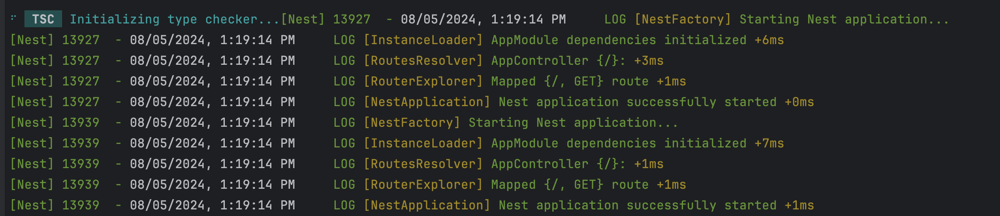

### NestJS && SWC bug report
### Issue: Application initializes twice when using SWC with NestJS

### Screenshot:

### Explaining:
1. When you run `npm run start:dev` — the application initializes twice
2. The first process `13927` on the screen is getting killed right after the second process `13939` is initialized
3. The second process is the one that is actually running the application

### Steps to reproduce:
1. Clone the repository
2. Run `npm ci`
3. Run `npm run start:dev`